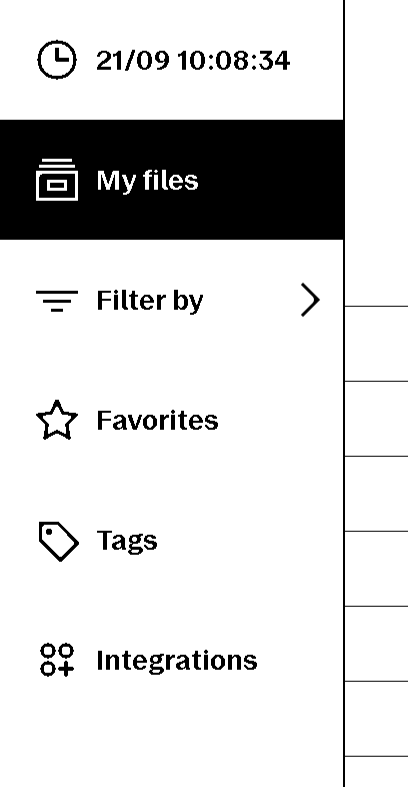
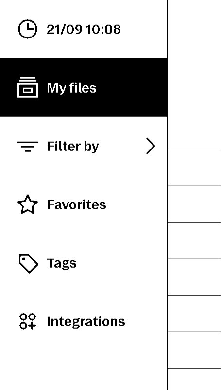
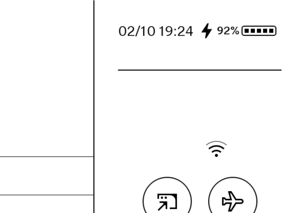
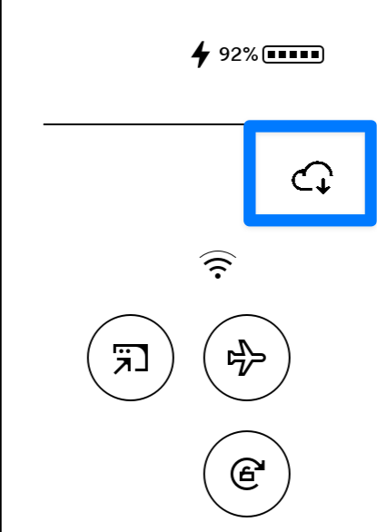
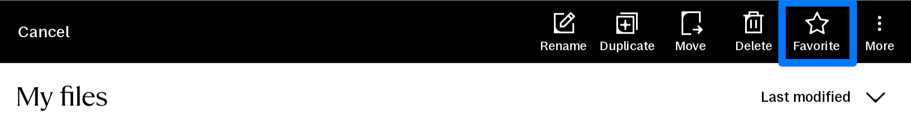
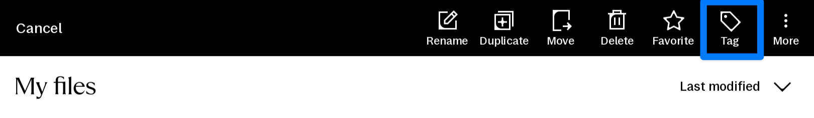
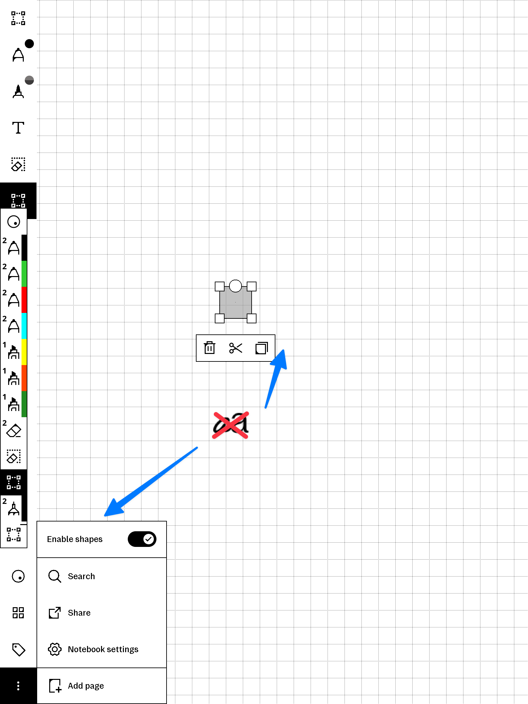

# Xovi Extensions

This repo consists of multiple xovi (.qmd) extensions that are QoL improvements to the xochitl interface. These require [qt-resource-rebuilder](https://github.com/asivery/rm-xovi-extensions/tree/master/qt-resource-rebuilder) to work.

Instructions to install xovi can be found [here](https://github.com/asivery/rmpp-xovi-extensions/blob/master/INSTALL.MD). 

Download the extensions from the folder matching your reMarkable software version. 

Copy the `.qmd` files to `/home/root/xovi/exthome/qt-resource-rebuilder/` and restart xovi.

Some of the QMD files in this repo are my own and some are modifications I've made to extensions created by others in the community. Modifications will link to the original author.

Extensions have been tested only for the latest reMarkable OS version, though they may work on newer versions.

Beta releases are not tested nor supported.

**Note:** QMDs for version 3.22.4.2 are the same as the ones for 3.22.0.64.

**Note 2:** Make sure to use latest version of qt-resource-rebuilder for best compatibility.

## Extensions

### Version 3.23.0.64

#### `clock.qmd`
- Adds a live clock to the library sidebar; tap the entry to toggle seconds display.

#### `quickSettingsClock.qmd`
- Injects a tappable clock into the Quick Settings header; tap to toggle between minute and second precision.

#### `forceSync.qmd`
- Adds a cloud button in Quick Settings that forces a library sync when tapped (need further testing to confirm it works as intended).

#### `favoriteButton.qmd`
- Restores a `Favorite` action in the document list header for faster pinning.

#### `tagButton.qmd`
- Puts a `Tag` action next to other list controls to open the tag editor directly.

#### `convertToText_remover.qmd`
- Removes the `Convert to text` option from selection menus and the toolbar.

#### `uncompressDock.qmd`
- Replaces the condensed `More` menu in the new document dock with dedicated buttons for notebook, folder, and quick sheet creation.

#### `hideDocumentClose.qmd`
- Hides the close button in the document toolbar to prevent accidental exits.